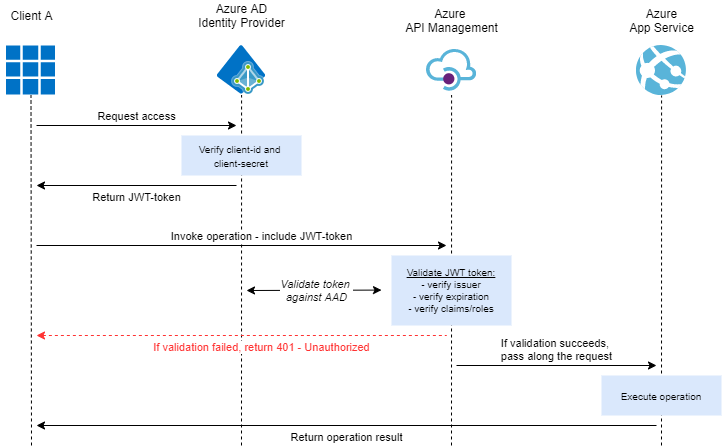

## Expose WSDL through SOAP APIM endpoint

Creating a new SOAP-based API within API Management is easy, just import the WSDL and your done. But, this API lacks an endpoint by which the actual WSDL is being exposed, as would be the case on a normal SOAP-service.  
Luckily, there is an easy way to achieve this, so you don't have to mail the WSDL to anyone interested.

## Steps
- [Overview](#overview)
- [Provision the required storage account](#provision-the-required-storage-account)
- [Create a new operation](#create-a-new-operation)
- [Build the policy](#build-the-policy)

### Overview
Before we get started, let's give an overview of how we can expose the WSDL through an API-endpoint and how everything will be connected.

Since a diagram gives a better overview than a whole bunch of text, have a look at the diagram added underneath and consider the fact that in this case we are actually going to expose a WSDL, stored as a blob inside a storage account.

[  ](../../images/azure-apim/s2s-ad-oauth2/high-level-overview.png) 

### Provision the required storage account

### Create a new operation

### Build the policy

```xml
<policies>
    <inbound>
        <!-- retrieve the content from the publicly accessible blob -->
        <send-request mode="new" response-variable-name="wsdlContent" timeout="30" ignore-error="true">
            <set-url>https://mbraekman-dev-we-kbstorage.blob.core.windows.net/wsdl/kb-soap-service-wsdl.wsdl</set-url>
            <set-method>GET</set-method>
        </send-request>
    </inbound>
    <backend>
        <!-- instead of forwarding the call to any back-end API, return the content of the WSDL instead. -->
        <return-response>
            <set-status code="200" reason="OK" />
            <set-header name="Content-Type" exists-action="override">
                <value>application/xml</value>
            </set-header>
            <!-- make sure to replace the default URL that is present in the WSDL to point towards the correct/environment-specific APIM endpoint. -->
            <set-body>@{
                string wsdlContent = ((IResponse)context.Variables["wsdlContent"]).Body.As<string>();
                string backendUrl = "https://mbr-api-app.azurewebsites.net/api/v1/soap";
                backendUrl = backendUrl.Replace("&amp;","&amp;amp;");
                wsdlContent = wsdlContent.Replace(backendUrl,"https://mbraekman-dev-we-apim.azure-api.net/soap/endpoint/");
                return wsdlContent.ToString();
            }</set-body>
        </return-response>
    </backend>
    <outbound />
    <on-error>
        <base />
    </on-error>
</policies>
```

### Conclusion
While API Management is more focused on exposing REST-based API's, you can still expose SOAP-services but you will need to add an additional endpoint specifically for exposing the WSDL to anyone who would be interested.

[&larr; back](index)
