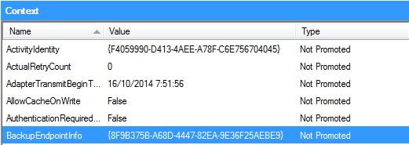
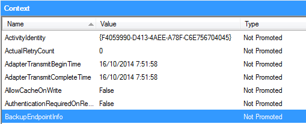
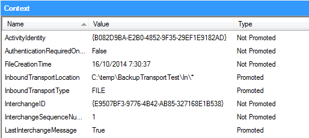

## Detecting the primary/backup transport type from a BizTalk pipeline

> Ever needed the actions performed by a pipeline component to be different according to the  usage of the main or backup transport? This post explains how you can implement a simple verification, before actually performing any of the required changes.  

---

In some occasions an interface requires the send ports to have a configured backup transport location, just in case the primary location is unreachable. These send ports could also be using a pipeline component which has to perform a couple of actions before allowing the file to be transmitted to its destination. Of course the configuration of these components can be modified per send port, but what if these actions also need to differ if the main location is unreachable and the backup transport is being used?  

For the purpose of this post let’s say we will be moving a file from one location to another and we need to configure a backup location, just in case. An additional requirement is that the filename needs to contain some values present in the message body, but needs to differ depending on the main/backup location.  
Before we start developing the custom pipeline component – needed because of the filename requirement – we need to find out how we can implement a check on what location is being used.  

This can be done by setting up a receive and send port, of course with a configured backup transport location on the latter, and make sure the primary send location is unreachable to allow for the backup transport to kick in. Looking at the tracking this would give us something as shown below.  


As you can see, current configuration allows the send port to retry 3 times before allowing the backup transport to be used. Once an attempt is being made to send to the backup location, the message is processed successfully.  
Now let’s have a closer look at how we can identify what type of transport location is being used. Opening up the context properties of the first ‘transmission failure’-record shows us the existence of a context property named ‘**_BackupEndpointInfo_**’  



As you can see, this property is containing a **GUID** referencing to the backup transport which can be used if the main location is unreachable. Now, what if we have a look at the context properties of the message when it is actually being sent over the backup transport?  



The ‘_BackupEndpointInfo_’-property is still present, although it **no longer contains any value**, since a backup location cannot have another backup.  
In order to have a complete overview of the existence/usage of this property, let’s create a send port which does not have a backup transport location configured, and is referring to a correct, reachable location. Send another message through this flow and look at the context properties of the message being processed by this new send port.



Note that these properties are sorted alphabetically and **no** ‘_BackupEndpointInfo_’-property is present.  
So, this means the property is only available when the backup transport is configured and only contains a value if the send port is sending to the main transport location.

### Implementation within custom pipeline component

Since we have figured out what property can be used to check the transport location used, this info can be used to implement our custom pipeline component.  
The code can be found below, but to summarize, you have to attempt to retrieve the BackupEndpointInfo-property from the context. If the returned object is _NULL_, no backup transport has been configured. If the property is present, you can define based on the value if the actual backup transport is being executed or not.

```cs
public Microsoft.BizTalk.Message.Interop.IBaseMessage Execute(IPipelineContext pContext, Microsoft.BizTalk.Message.Interop.IBaseMessage pInMsg)
{
    object backupTransportVal = pInMsg.Context.Read("BackupEndpointInfo", "http://schemas.microsoft.com/BizTalk/2003/system-properties");
    
    if (backupTransportVal == null)
    {
        // Not present => no backupTransport configured => use default
	    // Perform Actions
    }
    else
    {
        string sBackupTransportVal = backupTransportVal.ToString();
        if (!String.IsNullOrEmpty(sBackupTransportVal))
        {
            // Present, not empty => BackupTransport is configured, but not executing the backupTransport
            // Perform Actions
        }
        else
        {
            // Present, but empty => BackupTransport is configured and is being executed
            // Perform Actions
        }
	}
	// Continue with additional actions
}
```

### Conclusion  
Whenever you need to find out if a backup transport is configured and is being executed, check the context properties for the existence of the context property ‘**BackupEndpointInfo**’, for namespace ‘http://schemas.microsoft.com/BizTalk/2003/system-properties’.

| Available     | Value         | Exaplanation  |
| ------------- |:------------- | :-----|
| No            | /             | No backup transport location configured. |
| Yes           | GUID          | Backup transport location configured, but not being used. |
| Yes           | Empty         | Backup transport location configured and currently being used. |

---

[&larr; back](index.md)
